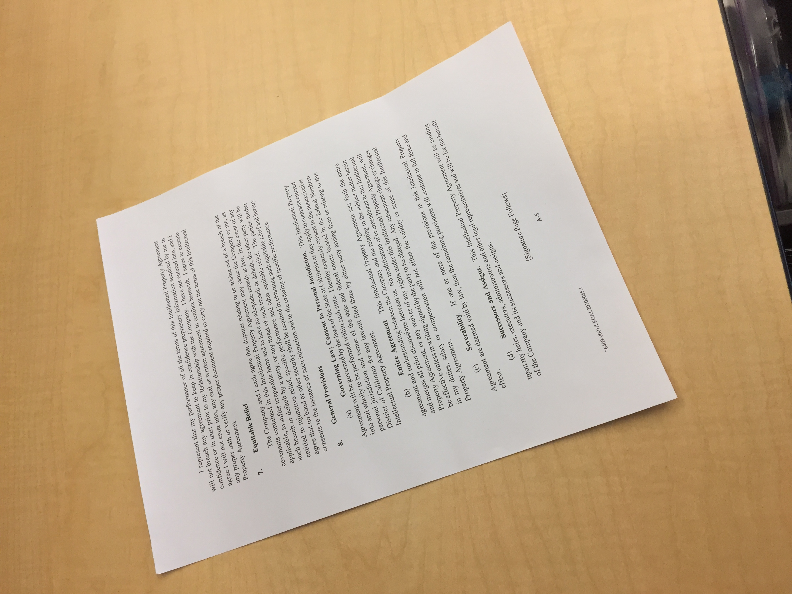

# Perspective transformation

This repository explores practical use of perspective transformations in computer vision. We focus on three applications: correcting document images to make them look like scanned copies, generating aerial (bird's eye) views from regular photos, and creatively changing viewpoints in artworks. For example, in document correction, the aim is to turn a photo of a paper or ID card taken at an angle into a clean, front-facing image. In aerial view generation, perspective transformation helps convert side view photos into top-down views, which is useful in areas like traffic analysis, sports, and urban planning. We also explore how changing perspectives can give new artistic interpretations to classic images.

## 🔧 Technical Pipeline (General for All):

Detect four points (source points)  automatically.

Define destination points based on the desired output view.

Compute the perspective transformation matrix using OpenCV’s getPerspectiveTransform().

Apply the transformation with warpPerspective().

Display and save the result.

## ▶️ How to Run

### 1. Clone the repository

git clone https://github.com/Filsduvent/Persperctive_transformation.git

cd Perspective_transformation

### 2. Install dependencies

pip install -r requirements.txt

### 3. Run the pipeline

python main.py

This command starts an interactive menu in the terminal, where the user can choose which operation to perform among the three available options: Document Perspective Correction, Aerial View Simulation, and Artistic Point of View Change. The program will continue to run until the user selects the option to exit.

## 📸 Results

The results are organized into three subsections, each corresponding to one of the use cases developed in this project:

Document Perspective Correction
Aerial View Simulation
Artistic Point of View Change

The images below represent for each use case examples of input images, its corresponding showing contours drawn and their corresponding transformed output.

## Document perspective Correction

  
  
  

  
  
  

## Aerial View simulation

  
  
  

  
  
  

## Painting Point of view change

  
  
  

  
  
  

